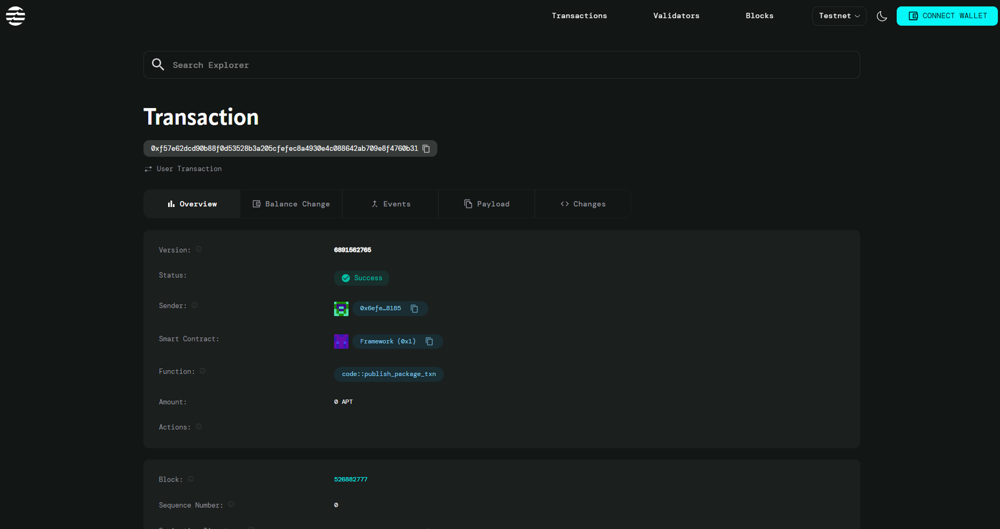

# 🎲 Aptos Dice Game / Lucky Draw

A simple fullstack Aptos blockchain dApp built with **Move + Vite + React**.  
💡 Concept: Users pay **1 APT** to roll a dice. If the roll is **6**, they win **2 APT** back!

---

## 🚀 Step-by-Step Setup

### 1. Prerequisites
Make sure you have these installed:
```bash
# Install Node.js (if not already)
# Install Aptos CLI
curl -fsSL "https://aptos.dev/scripts/install_cli.py" | python3
```

### 2. Create the Project
```
# Create Vite + React project
npm create vite@latest aptos-dice-game -- --template react
cd aptos-dice-game

# Install dependencies
npm install @aptos-labs/ts-sdk @aptos-labs/wallet-adapter-react petra-plugin-wallet-adapter
npm install
```
### 3. Create the Smart Contract

```
# Create a contract folder
mkdir contract
cd contract

# Initialize Aptos Move project
aptos move init --name dice_game

```

### Edit `Move.toml:`
```
[package]
name = "dice_game"
version = "1.0.0"
authors = []

[addresses]
dice_game = "_"

[dependencies.AptosFramework]
git = "https://github.com/aptos-labs/aptos-core.git"
rev = "mainnet"
subdir = "aptos-move/framework/aptos-framework"

```

### 4. Compile & Deploy Contract
```
# From inside contract/
aptos move compile

# Create an Aptos account
aptos init

# Fund it (Testnet faucet)
aptos account fund-with-faucet --account default

# Deploy contract
aptos move publish --named-addresses dice_game=default

```
### 5. Frontend Setup

- Open src/App.jsx

- Replace 0xYOUR_CONTRACT_ADDRESS_HERE with your deployed address.

### 6. Run the App

```
# From project root
npm run dev

```

Visit: http://localhost:5173


## 🌍Contact Details

0xf57e62dcd90b88f0d53528b3a205cfefec8a4930e4c088642ab709e8f4760b31

